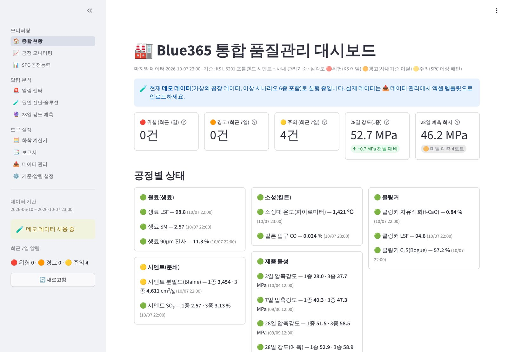
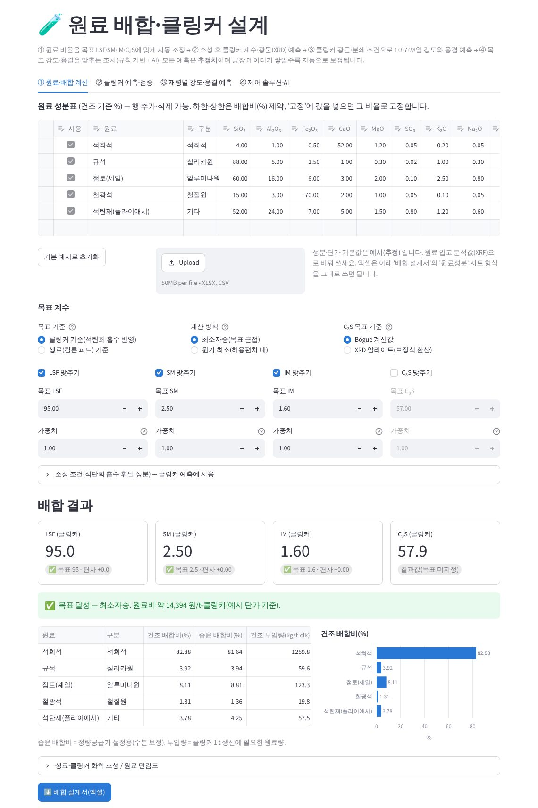
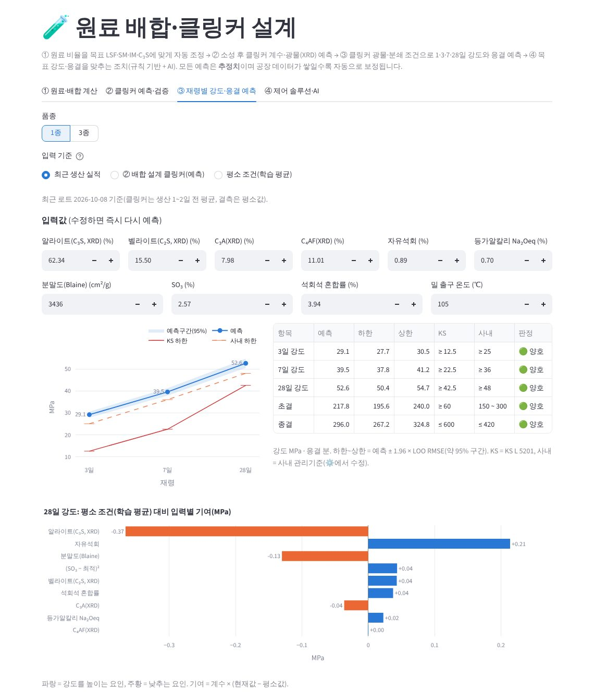
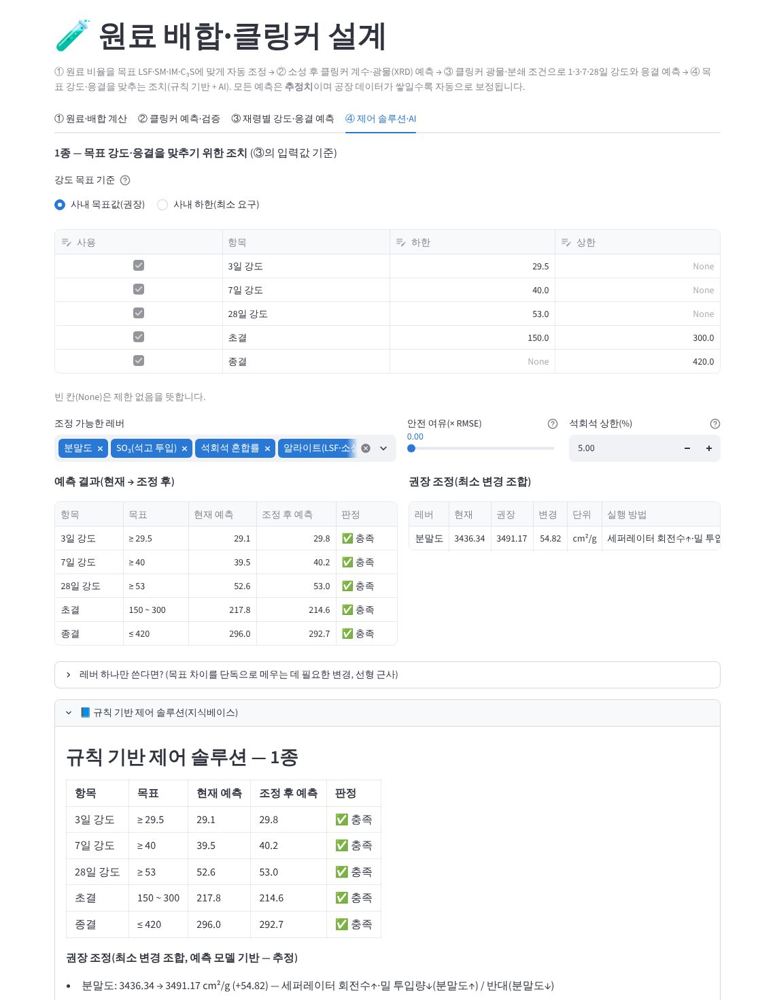
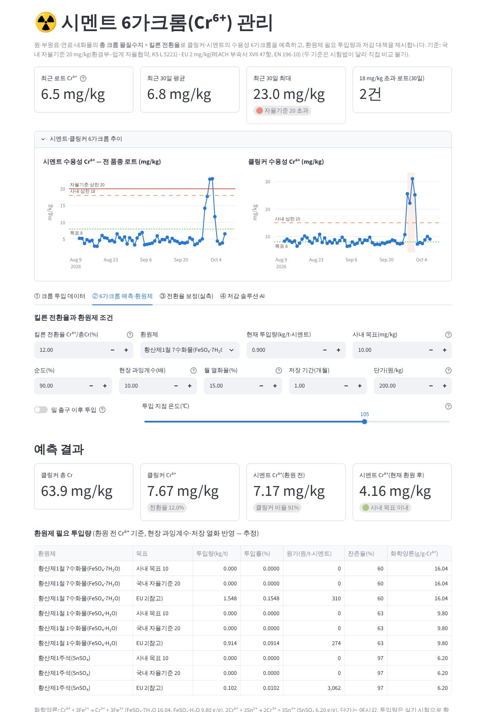
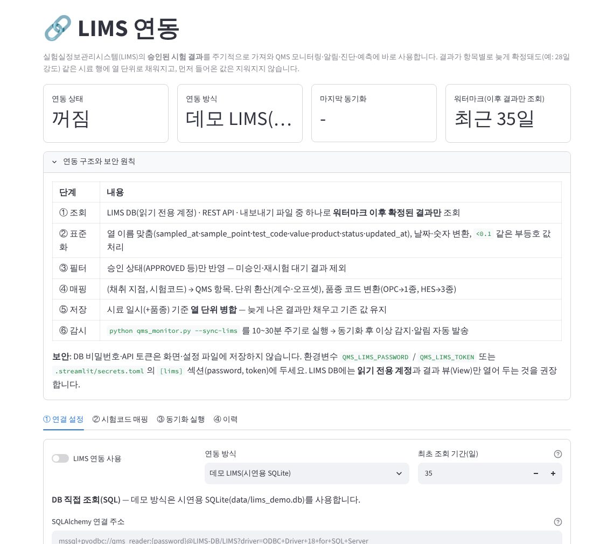

# 🏭 Blue365 — 시멘트 통합 품질관리 시스템(QMS)

원료(생료)부터 소성(킬른)·클링커·분쇄·제품 물성까지 품질 데이터를 **한곳에서 감시**하고,
KS 규격·사내 관리기준·SPC 판정규칙을 벗어나면 **자동으로 알리며**, 이상의 **원인을 5축(화학·원료·공정·설비·시험오차)으로
진단해 대책까지 제시**하는 웹 대시보드입니다. 2단계에서 **원료 배합 설계·클링커 예측, 재령별 강도·응결 예측과 제어 솔루션,
시멘트 6가크롬 관리, LIMS 연동, AI(Claude) 솔루션 보고서**를 더했습니다. 결과는 경영진 보고용 **PPT와 엑셀로 바로 내려받을 수 있습니다**.



## 주요 기능

| 구분 | 기능 | 내용 |
|---|---|---|
| 모니터링 | 📈 공정 모니터링 | 69개 관리항목(생료 LSF·SM·IM, 소성대 온도·CO, f-CaO·C₃S, XRD 광물, 분말도·SO₃·석회석, 1·3·7·28일 강도, 6가크롬, 시험조건)의 추세와 공정별 상태판 |
| 알림·분석 | 🚨 3단계 판정·알림 | 🔴위험(KS·법정/협약 기준 이탈) · 🟠경고(사내 관리기준 이탈) · 🟡주의(SPC 판정규칙 위반). 연속 위반은 1건으로 묶음. 이메일·메신저 발송 |
| 알림·분석 | 🧪 원인 진단·솔루션 | ① 현상 정량화 → ② 5축 원인 우선순위(데이터 근거 점수) → ③ 확인 방법 → ④ 단기 조치 vs 근본 대책 → ⑤ KS·관리기준 평가. **사실(데이터 지지)과 추정 구분** |
| 알림·분석 | 🔮 28일 강도 조기 예측 | 1·3·7일 강도·분말도·SO₃·C₃S 회귀(LOO 오차 표시)로 28일 결과 전에 미달 경보 |
| **배합·품질설계** | 🧪 **원료 배합·클링커 설계** | 석회석·실리카원·알루미나원·철질원·기타 원료 비율을 **목표 LSF·SM·IM·C₃S에 맞게 자동 조정**(제약 최소자승 / 원가 최소) → **클링커 계수·Bogue·XRD 광물·f-CaO 예측** → **재령별(1·3·7·28일) 강도·초결·종결 예측** → **초기·장기강도·응결 제어 조치** 제시(최소 변경 조합 + 지식베이스 + AI) |
| **배합·품질설계** | ☢️ **시멘트 6가크롬** | 원·부원료·연료·내화물 **총 크롬 물질수지 × 킬른 전환율**로 클링커·시멘트 수용성 Cr⁶⁺ 예측, **환원제(FeSO₄·SnSO₄) 필요 투입량·원가**, 파레토·민감도, **실측 기반 전환율 보정**, 저감 솔루션(규칙 + AI) |
| 도구·설정 | 🔗 **LIMS 연동** | LIMS DB(SQL)·REST API·내보내기 파일에서 **승인된 결과만 증분 동기화**, 시험코드 매핑·단위 환산·품종 코드 변환, 열 단위 병합 저장 |
| 도구·설정 | 🤖 **AI 솔루션 보고서** | 계산 결과(JSON)와 지식베이스만 근거로 Claude가 5단계 보고서 작성(스트리밍). 키가 없으면 규칙 기반 솔루션만 표시 |
| 도구·설정 | 📑 보고서·📥 데이터 | 경영진 보고 PPT·이상 분석 PPT·데이터 엑셀, 배합 설계서·6가크롬 평가표(엑셀), 엑셀 템플릿 업로드 |

## 빠른 시작

필요 환경: **Python 3.11 이상**(3.11·3.13에서 확인), Streamlit 1.55 이상(requirements.txt로 자동 설치).

```bash
# Windows (명령 프롬프트)                     # macOS·Linux
py -3.11 -m venv .venv                       # python3 -m venv .venv
.venv\Scripts\activate                        # source .venv/bin/activate
pip install -r requirements.txt
streamlit run streamlit_app.py               # 브라우저에서 http://localhost:8501 자동 열림 (종료: Ctrl+C)
```

- 설치 없이 보려면: GitHub 저장소에서 **Code → Codespaces → Create codespace**(설정 파일 `.devcontainer` 포함, 자동 설치·실행). 클라우드이므로 실데이터는 올리지 마세요.
- 사내망에서 같이 보려면: `streamlit run streamlit_app.py --server.address 0.0.0.0` 후 다른 PC에서 `http://<실행 PC IP>:8501`(방화벽 8501 허용, 접속 비밀번호 `[access] password` 설정 권장).
- `streamlit` 명령을 찾지 못하면 가상환경을 활성화하거나 `python -m streamlit run streamlit_app.py`로 실행하세요.

처음 실행하면 **데모 데이터**(가상 공장 120일, 이상 시나리오 7종)가 자동 생성됩니다(이전 버전 데모 DB는 자동 갱신).
실제 데이터는 `📥 데이터 관리 → 입력 템플릿`으로 업로드하거나 `🔗 LIMS 연동`으로 자동 반영하세요.

### 사내망 PC(인터넷 없음) — 오프라인 설치 패키지

인터넷이 막힌 사내망 PC에는 **설치 패키지(분할 ZIP 3개, 약 152MB)**를 옮겨 설치합니다. Python과 구성요소가 모두 들어 있어
**인터넷·관리자 권한·Python 설치가 필요 없습니다**(Windows 10/11 64비트).

| 순서 | 할 일 |
|---|---|
| ① | ZIP 3개를 같은 폴더에 두고, 각 파일 속성에서 '차단 해제' |
| ② | `1of3` ZIP만 `C:\`에 압축 해제 → `C:\Blue365_QMS` |
| ③ | `1_SETUP.bat` 실행 — 나머지 ZIP을 SHA-256 확인 후 자동 결합 → 컴파일 → 구성요소 점검 → 13개 화면 자체 시험 |
| ④ | `2_RUN.bat`(내 PC) 또는 `3_RUN_SHARE.bat`(사내망 공유, 처음 1회 `4_FIREWALL_ADMIN.bat` 관리자 실행) |

그 밖에 `5_MONITOR_TASK.bat`(작업 스케줄러 자동 감시), `6_BACKUP.bat`(데이터 백업), `9_CHECK.bat`(환경 점검 보고서).
자세한 안내는 패키지 안 `README.txt`([원본](packaging/windows/README.txt)).

패키지 만들기(빌드 PC, 인터넷·[uv](https://docs.astral.sh/uv/) 필요): `python scripts/build_windows_package.py` → `dist/windows/`
- Python: python.org 공식 NuGet 배포본(3.13.16)을 받아 NuGet 카탈로그의 SHA-512·게시자(Python Software Foundation)와 대조
- 구성요소: `packaging/windows/requirements-windows.lock`(해시 고정, 테스트 통과 버전 `constraints-tested.txt` 기준)을
  Windows 64비트용으로 미리 설치하고, 실행에 쓰지 않는 테스트·헤더 파일(약 81MB)은 정리
- 결과: 분할 ZIP(파일당 95MB 이하, 사내 자료전송 용량 제한 대응) + `SHA256SUMS.txt` + `components.xlsx`(구성요소·라이선스·해시 명세, IT 보안 검토용)
- 공유 실행 시 접속 비밀번호: `.streamlit/secrets.toml`의 `[access] password`(또는 환경변수 `QMS_ACCESS_PASSWORD`)

## 화면 구성

| 메뉴 | 화면 | 핵심 |
|---|---|---|
| 모니터링 | 🏠 종합 현황 · 📈 공정 모니터링 · 📊 SPC·공정능력 | KPI, 공정별 상태, I-MR 관리도, Cpk |
| 알림·분석 | 🚨 알림 센터 · 🧪 원인 진단·솔루션 · 🔮 28일 강도 예측 | 이벤트 처리 기록, 5단계 진단, 조기 경보 |
| 배합·품질설계 | 🧪 원료 배합·클링커 설계 · ☢️ 시멘트 6가크롬 | 아래 상세 |
| 도구·설정 | 🧮 화학 계산기 · 📑 보고서 · 📥 데이터 관리 · 🔗 LIMS 연동 · ⚙️ 기준·알림 설정(AI 탭 포함) | |

### 🧪 원료 배합·클링커 설계



| 탭 | 내용 |
|---|---|
| ① 원료·배합 계산 | 원료 성분표(산화물·강열감량·수분·총Cr·단가·하한/상한/고정) 편집·업로드 → 목표(클링커 기준 또는 생료 기준) 자동 배합. 건조/습윤(정량공급기) 배합비, kg/t-클링커, 원료비, 원료 1%p 민감도, **배합 설계서 엑셀** |
| ② 클링커 예측·검증 | 예측 LSF·SM·IM, Bogue 광물, 액상량, Na₂Oeq, **f-CaO(소성성 회귀)**, **XRD 광물(보정식)** 과 사내 기준·최근 실측 비교. **생료 실측 → 클링커 예측 vs 클링커 실측** 검증과 석탄회 흡수율 보정 제안 |
| ③ 재령별 강도·응결 예측 | 입력 기준(최근 생산 실적 / 배합 설계 클링커 / 평소 조건)을 고르고 광물·분쇄 조건을 바꿔 보며 **1·3·7·28일 강도·초결·종결** 예측(95% 구간), KS·사내 판정, **입력별 기여도** |
| ④ 제어 솔루션·AI | 목표(사내 목표값 또는 하한, 응결 범위)를 **최소 변경 비용**으로 맞추는 레버 조합(분말도·SO₃·석회석·알라이트·C₃A·자유석회·밀 온도), 레버 단독 필요량, 초기강도·장기강도·응결 조치 라이브러리, **AI 보고서** |




### ☢️ 시멘트 6가크롬



| 탭 | 내용 |
|---|---|
| (상단) 현황 | 최근 로트·30일 평균·최대(자율기준 20 초과 여부)·18 초과 로트, 시멘트·클링커 Cr⁶⁺ 추이 |
| ① 크롬 투입 데이터 | 킬른 투입물(원료·부원료·연료, kg/t-클링커 × 총Cr × 잔류율 — 배합 결과 연동), 내화물 마모·Cr₂O₃, 분쇄매체, 시멘트밀 혼합재 |
| ② 6가크롬 예측·환원제 | 전환율·환원제(종류·순도·과잉계수·열화·저장기간·투입 위치) → 클링커/시멘트 Cr⁶⁺, **필요 투입량·원가(사내 목표/국내 20/EU 2)**, 파레토, 토네이도, **평가표 엑셀** |
| ③ 전환율 보정(실측) | 클링커 총Cr·Cr⁶⁺ 실측 짝(+같은 날 O₂·Na₂Oeq 자동 결합) → 전환율 중앙값·회귀식, ② 적용. 로트별 **환원제 실효 제거량** |
| ④ 저감 솔루션·AI | 단기 조치 vs 근본 대책(원료·연료 Cr 관리, 크롬프리 내화물, O₂·알칼리 관리, 투입 위치, SnSO₄ 검토, 저장 기간, 시험 체계) + **AI 보고서** |

### 🔗 LIMS 연동



1. **연결 방식 선택**: DB 직접 조회(SQLAlchemy — MSSQL·Oracle·PostgreSQL 등, **읽기 전용 계정 권장**) / REST API / 내보내기 파일 폴더 / 데모
2. **조회문**: LIMS 결과를 표준 열 이름(`sampled_at, sample_point, test_code, value, product, status, unit, updated_at`)으로 AS 별칭, `:since` = 워터마크
3. **시험코드 매핑**: (채취 지점, 시험코드) → QMS 항목, 계수·오프셋(단위 환산), 품종 코드(OPC→1종, HES→3종), 승인 상태 필터
4. **동기화**: 미리보기 → 실행. 워터마크 이후 결과만 가져와 **열 단위 병합**(늦게 나온 28일 강도도 같은 로트 행에 채움). 미매핑 코드·부등호 값(`<0.1`) 보고
5. **무인 운영**: `python qms_monitor.py --sync-lims --since-hours 24` 를 10~30분 주기로 실행 → 동기화 후 이상 감지·알림

비밀번호·토큰은 환경변수 `QMS_LIMS_PASSWORD` / `QMS_LIMS_TOKEN` 또는 `.streamlit/secrets.toml` `[lims]`에만 둡니다(설정 파일·저장소에 저장 안 함, URL에 평문 비밀번호가 있으면 저장 거부).

## 계산 방식

### 원료 배합(조합) 계산 — `qms/rawmix.py`
- 클링커 산화물(석탄회 흡수 반영): `C_j = (1−a)·Σx_i·ox_ij / D + a·ash_j`, `D = Σx_i(1−LOI_i/100)`, `a = 석탄 원단위 × 회분 × 흡수율`
- 분모를 곱하면 x에 대해 선형: `E_j(x) = C_j·D` → LSF·SM·IM·C₃S(Bogue) 목표를 선형식으로 만들어 **원료별 하한·상한·고정 제약 최소자승**(scipy `lsq_linear`) 또는 **허용편차 내 원가 최소 LP**(`linprog`)로 풉니다. 분모·SO₃·f-CaO는 해에 따라 3~4회 갱신.
- f-CaO 예측: `f-CaO ~ LSF + SM + 생료 90μm 잔사 + 소성대 온도` 공장 데이터 회귀(데이터 부족 시 경험식). XRD 광물: 같은 날 XRD 실측과 Bogue 계산값의 회귀 보정식.

### 재령별 강도·응결 예측 — `qms/strength.py`
- 입력: XRD 알라이트·벨라이트·C₃A·C₄AF·자유석회(생산 1~2일 전 클링커), Na₂Oeq, 분말도, (SO₃−최적)², 석회석 혼합률(강도) / SO₃·분말도·C₃A·Na₂Oeq·밀 온도·석회석·자유석회(응결)
- **경험칙 사전정보 리지 회귀**: 경험칙 계수에서 출발해 공장 데이터로 보정(λ는 LOO 오차 최소, 유효 자유도 ≤ n/3). 이론과 부호가 반대인 계수는 경험칙 값으로 고정, **시험조건(KS L ISO 679) 이탈 로트는 학습 제외**. 데이터가 적은 품종·재령은 경험칙에 가깝게 유지(과적합·외삽 방지).
- 예측구간 = 예측 ± 1.96 × LOO RMSE. 데모 1종: 3일 RMSE 0.71, 7일 0.87, 28일 1.08 MPa.
- 제어 최적화: 레버 변경 비용(부드러운 L1 + L2) 최소 + 목표 위반 벌점(L-BFGS-B), 운전상 의미 없는 미세 변경은 제거 → 필요한 레버만 제시. 레버 결합: 알라이트 +1%p ⇒ 벨라이트 −0.75%p(C₂S+CaO→C₃S 질량비), C₃A +1%p ⇒ C₄AF −0.70%p.

### 시멘트 6가크롬 — `qms/chromium.py`
- 클링커 총 Cr(mg/kg) = Σ 투입량(kg/t) × 총Cr(mg/kg) × 잔류율 / 1000 + 내화물 마모(kg/t) × Cr₂O₃(%) × 6.842
- 클링커 Cr⁶⁺ = 총 Cr × 킬른 전환율(문헌 약 8~20%, **실측 보정 필수**) / 시멘트 Cr⁶⁺(환원 전) = 클링커 비율 × 클링커 Cr⁶⁺ + 혼합재 + 분쇄매체
- 환원제 화학양론(g/g-Cr⁶⁺): FeSO₄·7H₂O **16.04**, FeSO₄·H₂O **9.80**, SnSO₄ **6.20** (Cr⁶⁺+3Fe²⁺, 2Cr⁶⁺+3Sn²⁺). 유효 능력 = 투입량 × 순도 × 잔존율 / (화학양론 × 현장 과잉계수)

## AI(LLM) 솔루션 — 설계 원칙

| 원칙 | 구현 |
|---|---|
| 숫자는 계산이, 해설은 AI가 | 배합·강도·6가크롬 수치와 최적화 결과는 결정론적 계산. AI는 그 JSON과 지식베이스만 근거로 해설·조치 계획 작성(새 수치 생성 금지) |
| 사실/추정 구분 | 출력 문장마다 [사실]/[추정]/[경험칙] 표기, 근거 없는 내용은 '확인 필요', KS·법규는 제공된 기준만 인용 |
| 보고서 형식 고정 | 결론(3줄) → 현상·목표 차이 표 → 5축 원인 → 단기/근본 조치(효과·부작용·확인·담당) → 추가 데이터 → 주의 |
| 데이터 보안 | 원 데이터 DB·개인정보 미전송, 전송 JSON을 화면에서 확인. **사내 정보보안 승인 후 사용** |
| 안정성·감사 | 스트리밍, 응답 거부 시 서버 측 대체 모델(`fallbacks: "default"`), 거부·오류 시 규칙 기반 솔루션 유지, 호출 기록(`data/ai_log.jsonl`: 모델·토큰·비용·입력 해시) |
| 비용 | 시스템 프롬프트(규칙+지식베이스) 캐시. 1회 약 $0.09(Opus 5.5, 약 130원 — 추정), Haiku 5.5 약 $0.002 |

설정: `⚙️ 기준·알림 설정 → AI(LLM)` 탭(사용·모델·추론 깊이·최대 토큰). API 키는 환경변수 `ANTHROPIC_API_KEY` 또는 `.streamlit/secrets.toml` `[anthropic] api_key`.

## 판정 체계

| 심각도 | 조건 | 예 | 대응(제안) |
|---|---|---|---|
| 🔴 위험 | 제품 항목이 KS L 5201 규격 또는 협약 기준 이탈 | 시멘트 SO₃ 3.5% 초과(1종), 6가크롬 20 mg/kg 초과(자율기준) | 즉시 출하 판정 |
| 🟠 경고 | 사내 관리기준 이탈 / 시험조건(KS L ISO 679) 이탈 / 28일 예측 미달 | f-CaO 1.8% 초과, 6가크롬 18 초과 | 당일 원인 조사 |
| 🟡 주의 | 규격 이내이나 SPC 판정규칙 위반 | 생료 LSF 8시간 평균 9연속 중심선 위 | 3일 내 점검 |

- 1·2시간 간격 데이터는 **8시간 평균에 SPC 규칙 적용**(자기상관 허위 경보 감소), 규격·관리기준 이탈은 개별값 판정.
- 사내 관리기준 기본값은 **업계 경험칙 초기값(추정)** 입니다. [관리항목·기준 정의서](docs/QMS_관리항목_기준정의서.xlsx)로 확정하세요.

## 데모 시나리오와 검증 결과

| 코드 | 주입한 원인 | 시스템 1순위 진단 |
|---|---|---|
| S1 | 석탄 발열량 저하 → 소성 부족 | [공정] 소성 부족 (데이터 지지) — f-CaO·XRD 알라이트·28일 강도 |
| S6 | 석회석 백운석 혼입 → MgO↑ | [원료] MgO 증가 (데이터 지지) — XRD 페리클레이스 포함 |
| S2 | 석회석 품위 변화·조합 보정 지연 | [원료] 생료 LSF 과다 (데이터 지지) |
| S5 | 양생수조 온도 이탈 | [시험오차] 시험 조건 이탈 (데이터 지지) — 강도 모델 학습에서도 자동 제외 |
| S4 | 석고 정량공급기 이상 | [설비] 석고 정량공급기 이상 (**데이터 없음(추정)**) |
| S3 | 세퍼레이터 이상 → 분말도 저하 | [공정] 분말도 저하 (데이터 지지) — 3일 강도·28일 예측 경보 |
| S7 | 철질원을 고Cr 제강슬래그로 대체 | [원료] 원·부원료·연료 크롬 투입 증가 (데이터 지지) — 6가크롬 자율기준 초과 🔴 |

데모 데이터에서 모델이 생성식을 되찾는지도 확인했습니다: f-CaO 회귀 LSF 계수 0.33(생성 0.32), XRD 알라이트 ≈ Bogue + 6.5, 석탄회 흡수 0.0151(생성 0.015), 킬른 전환율 12.1%(생성 12%), 환원제 실효 제거 3.0 mg/kg(생성 3.0).
※ 가상 데이터 검증이므로 실제 성능은 실데이터 시범 운영에서 확인해야 합니다.

## 무인 감시(자동 알림)

```bash
python qms_monitor.py --sync-lims --since-hours 24        # LIMS 동기화 → 감지 → 발송
python qms_monitor.py --import-dir ./inbox --since-hours 24
python qms_monitor.py --dry-run                           # 발송 대상만 확인
```

비밀값: `.streamlit/secrets.toml`(예시: `.streamlit/secrets.toml.example`) 또는 환경변수 `QMS_SMTP_PASSWORD`, `QMS_WEBHOOK_URL`,
`QMS_LIMS_PASSWORD`, `QMS_LIMS_TOKEN`, `ANTHROPIC_API_KEY`. 데이터 폴더는 기본 `data/`(환경변수 `QMS_DATA_DIR`), 저장소에 올라가지 않습니다.

## 프로젝트 구조

```
streamlit_app.py            진입점(화면 메뉴)
app_pages/                  화면 13개
qms/
  chemistry.py              LSF·SM·IM·Bogue·액상량·3성분 조합
  standards.py              관리항목·KS L 5201·협약 기준·사내 기준·설정
  store.py                  SQLite 저장(열 단위 병합)·엑셀 업로드
  spc.py · alerts.py        관리한계·판정규칙 · 위반 → 이벤트
  knowledge.py · diagnosis.py   5축 원인 지식베이스 · 증거 평가·5단계 분석
  prediction.py             28일 강도 조기 예측(LOO)
  rawmix.py                 원료 배합 최적화·클링커/XRD/f-CaO 예측·실적 검증·배합 설계서
  strength.py               재령별 강도·응결 예측(사전정보 리지)·제어 최적화·조치 지식베이스
  chromium.py               6가크롬 물질수지·환원제·전환율 보정·저감 지식베이스·평가표
  lims.py                   LIMS 연동(SQL·REST·파일)·매핑·증분 동기화·데모 LIMS
  llm.py · ai_context.py · ui_ai.py   AI 보고서(Claude API)·입력 JSON·화면 패널
  notify.py · reports.py    이메일·웹훅 · 엑셀·PPT 보고서
  access.py                 공유 실행용 접속 비밀번호(선택)
  demo.py                   데모 데이터(인과관계·시나리오 7종)
qms_monitor.py              무인 감시(LIMS 동기화·감지·발송)
scripts/build_definition_workbook.py   관리항목·기준 정의서(엑셀) 생성
scripts/build_windows_package.py       사내망(오프라인) Windows 설치 패키지 빌드
packaging/windows/          설치 도우미(qms_launcher.py)·자동 감시 실행기·배치 파일·안내서·잠금 파일
docs/                       정의서·보고서·샘플·화면
tests/                      자동 테스트 104건
```

## 근거·출처

| 구분 | 값 | 출처 / 확인 상태 |
|---|---|---|
| 압축강도 1종·3종 | 1종 3일 12.5/7일 22.5/28일 42.5, 3종 1일 10.0/3일 20.0/7일 32.5/28일 47.5 MPa 이상 | KS L 5201 — 웹 검색 확인(2026-10) |
| 분말도·응결·안정도·화학 | 분말도 1종 2,800·3종 3,300 cm²/g, 초결 60분↑·종결 10시간↓, 팽창도 0.8%↓, MgO 5.0%·SO₃ 3.5/4.5%·강열감량 5.0%↓ | KS L 5201 — 웹 검색 확인 |
| 강도 시험조건 | 시험실 20±2 ℃·RH 50%↑, 양생수 20±1 ℃ | ISO 679 규정값 — KS L ISO 679 원문 대조 필요 |
| 6가크롬 국내 | 20 mg/kg 이하(2009년 30→20, 업계 자율 관리), 시험 KS L 5221(JCAS I-51 기반) | 학회·보도 자료 — **협약 원문·현행 여부 확인 필요** |
| 6가크롬 EU | 2 mg/kg(수화 후 건조중량 기준 수용성 Cr⁶⁺), 시험 EN 196-10, 환원제 사용 시 포장일·보관조건 표기 | REACH 부속서 XVII 47항 |
| 6가 전환율 | 클링커 Cr의 약 8~20%가 6가로 전환, 산소·알칼리가 주 인자 | Costeri(2016), Hills & Johansen(2007, PCA) 인용 |
| 계산식 | LSF(Lea & Parker), Bogue(ASTM C150), 액상량(Lea & Parker), Na₂Oeq(ASTM C150), 환원제 화학양론(원자량) | 문헌·화학양론 |

- [e나라표준인증 KS L 5201](https://standard.go.kr/KSCI/standardIntro/getStandardSearchView.do?ksNo=KSL5201) · [한국시멘트협회 KS 규격 요약](http://www.cement.or.kr/tech_2014/standard.asp?sm=3_6_1)
- 6가크롬 국내: [한국콘크리트학회 2008 학술대회 논문(수용성 6가크롬 분석)](https://koreascience.kr/article/CFKO200823160549598.pub?lang=ko) · [세계일보 2024-10 "국내 시험법상 기준값은 만족"](https://segye.com/newsView/20241015520731) · [세계일보 2024-02 기준 개정 논란](https://www.segye.com/newsView/20240206516694)
- 6가크롬 EU: [ECHA 문서(REACH 부속서 XVII 47항)](https://poisoncentres.echa.europa.eu/documents/10162/1f775bd4-b1b0-4847-937f-d6a37e2c0c98) · [ChemSafetyPro 요약](https://chemsafetypro.com/Topics/Restriction/REACH_annex_xvii_Chromium_VI_compounds.html) · [MPA 준수 프로토콜 FS 10.7](https://cement.mineralproducts.org/MPACement/media/Cement/Publications/Fact-Sheets/FS_10_7_Compliance_protocol_Cr_VI_and_cement.pdf)
- 6가크롬 생성·저감: [Costeri 2016(PDF)](https://www.arpae.it/it/notizie/Costeri2016EES_v2.pdf) · [PCA 문헌 리뷰(Hills & Johansen 2007)](https://trid.trb.org/View/836928) · [IJERPH 2022 알칼리 영향](https://pmc.ncbi.nlm.nih.gov/articles/PMC9025607/) · [Estokova 외 2018](https://pmc.ncbi.nlm.nih.gov/articles/PMC5923866) · [클링커 소성 중 Cr⁶⁺ 저감(냉각대 2차 연료)](https://en.jcement.ru/magazine/330/10199/)
- 사내 관리기준 초기값·지식베이스·강도 경험칙 계수·환원제 과잉계수·열화율·원료 Cr 기본값은 **경험칙·예시(추정)** 이며 공장 데이터로 검증·보정해야 합니다.

## 산출물(docs)

- [QMS_구축계획_경영진보고.pptx](docs/QMS_구축계획_경영진보고.pptx) · [QMS_2단계_기능확장_보고.pptx](docs/QMS_2단계_기능확장_보고.pptx) — 경영진 보고용
- [QMS_관리항목_기준정의서.xlsx](docs/QMS_관리항목_기준정의서.xlsx) — 관리항목·KS·협약 기준·사내기준(확정값 입력 칸)·알림규칙·지식베이스·로드맵
- [samples/](docs/samples) — 자동 생성 샘플(경영진 보고 PPT, 이상 분석 PPT, 데이터 엑셀, **배합 설계서, 6가크롬 평가표**)

## 테스트

```bash
pip install -r requirements-dev.txt
python -m pytest -q        # 104건: 화학·SPC·알림·진단·예측·저장·배합·강도·6가크롬·LIMS·AI·화면 13개·설치 패키지
```

## 로드맵

1. **1단계 MVP (완료)** — 모니터링·알림·진단·예측·보고, 엑셀 업로드, 데모 데이터
2. **2단계 확장 기능 (완료)** — 원료 배합 최적화·클링커 예측, 재령별 강도·응결 예측·제어 솔루션, 6가크롬, LIMS 연동, AI 보고서
3. **3단계 실데이터 시범 (2~3개월, 추정)** — LIMS 실연결, 사내 기준·예측 모델·전환율·과잉계수 보정, AI 보안 승인·시범 사용
4. **4단계 고도화** — 조치 이력 기반 지식베이스 학습, 입도분포(PSD) 반영, 원료 품위 예측 연계 배합 자동 보정
5. **5단계 확산** — DB·OPC-UA 실시간 연계, 모바일 알림, 타 공정·공장 확산
