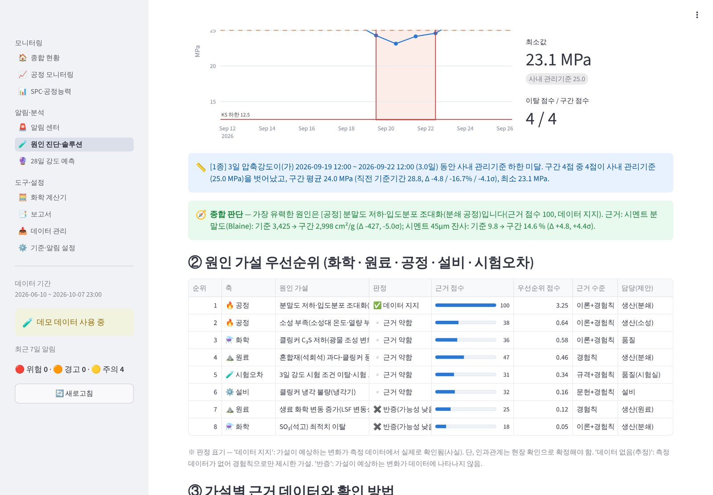

# 🏭 Blue365 — 시멘트 통합 품질관리 시스템(QMS)

원료(생료)부터 소성(킬른)·클링커·분쇄·제품 물성까지 품질 데이터를 **한곳에서 감시**하고,
KS 규격·사내 관리기준·SPC 판정규칙을 벗어나면 **자동으로 알리며**, 이상의 **원인을 5축(화학·원료·공정·설비·시험오차)으로
진단해 대책까지 제시**하는 웹 대시보드입니다. 결과는 경영진 보고용 **PPT와 엑셀로 바로 내려받을 수 있습니다**.


## 주요 기능

| 기능 | 내용 |
|---|---|
| 📈 모니터링 | 58개 관리항목(생료 LSF·SM·IM, 소성대 온도·CO, f-CaO·C₃S, 분말도·SO₃, 1·3·7·28일 강도, 시험조건)의 추세와 공정별 상태판 |
| 🚨 3단계 판정·알림 | 🔴위험(KS L 5201 이탈) · 🟠경고(사내 관리기준 이탈) · 🟡주의(SPC 판정규칙 위반). 연속 위반은 1건으로 묶어 알림 피로도 감소. 이메일·메신저(웹훅) 발송 |
| 🧪 원인 진단·솔루션 | ① 현상 정량화 → ② 5축 원인 가설 우선순위(데이터 근거 점수) → ③ 확인 방법 → ④ 단기 조치 vs 근본 대책 → ⑤ KS·관리기준 평가. **사실(데이터 지지)과 추정(데이터 없음)을 구분 표기** |
| 🔮 28일 강도 조기 예측 | 1·3·7일 강도·분말도·SO₃·클링커 C₃S 회귀 모델(LOO 오차 표시)로 28일 결과 전에 미달을 경보 |
| 📊 SPC·공정능력 | I-MR 관리도, Nelson/WE 판정규칙(R1·R2·R3·R5·R6), Cp·Cpk·Pp·Ppk, 히스토그램 |
| 🧮 화학 계산기 | LSF·SM·IM, Bogue(ASTM C150) 광물 조성, 1450 ℃ 액상량, 3성분 원료 조합 계산 |
| 📑 보고서 | 경영진 보고 PPT(편집 가능한 네이티브 차트) · 이상 분석 PPT(5단계) · 데이터 엑셀 자동 생성 |
| 📥 데이터 연계 | 엑셀 템플릿 업로드, LIMS·DCS 내보내기 폴더 자동 반영(`qms_monitor.py`) |

## 빠른 시작

```bash
pip install -r requirements.txt
streamlit run streamlit_app.py
```

처음 실행하면 **데모 데이터**(가상 공장 120일 데이터, 이상 시나리오 6종 포함)가 자동 생성됩니다.
실제 데이터는 `📥 데이터 관리 → 입력 템플릿`을 내려받아 작성한 뒤 업로드하세요(업로드 시 데모 데이터 삭제 선택 가능).

## 판정 체계

| 심각도 | 조건 | 예 | 대응(제안) |
|---|---|---|---|
| 🔴 위험 | 제품 항목이 KS L 5201 규격 이탈 | 시멘트 SO₃ 3.5% 초과(1종) | 즉시 출하 판정 |
| 🟠 경고 | 사내 관리기준 이탈 / 시험조건(KS L ISO 679) 이탈 / 28일 예측 미달 | f-CaO 1.8% 초과, 양생수 19~21 ℃ 이탈 | 당일 원인 조사 |
| 🟡 주의 | 규격 이내이나 SPC 판정규칙 위반 | 생료 LSF 8시간 평균 9연속 중심선 위 | 3일 내 점검 |

- 1·2시간 간격 데이터(생료·킬른·클링커·시멘트)는 자기상관으로 인한 허위 경보를 줄이기 위해 **8시간(근무조) 평균에 SPC 규칙을 적용**하고, 규격·관리기준 이탈은 개별값으로 판정합니다.
- 사내 관리기준 기본값은 **업계 경험칙 초기값(추정)** 입니다. `⚙️ 기준·알림 설정` 또는 [관리항목·기준 정의서](docs/QMS_관리항목_기준정의서.xlsx)로 공장 기준을 확정하세요.

## 원인 진단 방식



- 지식베이스(`qms/knowledge.py`): 33개 현상 × 144개 원인 가설. 가설마다 메커니즘, 자동 평가할 데이터 조건, 확인 방법, 단기 조치, 근본 대책, 근거 수준(이론·문헌·규격·경험칙)을 정의합니다.
- 근거 점수: 관련 항목의 이벤트 구간 평균을 직전 14일과 비교한 효과크기(σ)로 0~100점을 매깁니다. 특수 증거로 *28일 실측 − 조기강도 예측 잔차*(시험오차 판별)와 *단발성 여부*(재분석 우선)를 사용합니다.
- 순위: 판정 등급(데이터 지지 → 부분 확인 → 데이터 없음(추정) → 근거 약함 → 반증) 우선, 같은 등급은 점수 순.
- 이벤트 항목 자신은 증거로 쓰지 않습니다(순환논리 방지).

## 데모 시나리오와 검증 결과

| 코드 | 주입한 원인 | 시스템 1순위 진단 |
|---|---|---|
| S1 | 석탄 발열량 저하 → 소성 부족 | [공정] 소성 부족 (데이터 지지) — f-CaO·28일 강도 모두 |
| S6 | 석회석 백운석 혼입 → MgO↑ | [원료] MgO 증가 (데이터 지지) |
| S2 | 석회석 품위 변화·조합 보정 지연 | [원료] 생료 LSF 과다 (데이터 지지) |
| S5 | 양생수조 온도 이탈 | [시험오차] 시험 조건 이탈 (데이터 지지) |
| S4 | 석고 정량공급기 이상 | [설비] 석고 정량공급기 이상 (**데이터 없음(추정)** — 측정값이 없는 설비 원인) |
| S3 | 세퍼레이터 이상 → 분말도 저하 | [공정] 분말도 저하 (데이터 지지) — 3일 강도·28일 예측 경보 |

※ 가상 데이터 검증이므로 실제 성능은 실데이터 시범 운영에서 확인해야 합니다.

## 무인 감시(자동 알림)

```bash
# 10~30분 주기로 cron / Windows 작업 스케줄러에 등록
python qms_monitor.py --import-dir ./inbox --since-hours 24
python qms_monitor.py --dry-run          # 발송 대상만 확인
```

알림 비밀값은 `.streamlit/secrets.toml`(예시: `.streamlit/secrets.toml.example`) 또는 환경변수 `QMS_SMTP_PASSWORD`, `QMS_WEBHOOK_URL`로 설정합니다.
데이터 폴더는 기본 `data/`이며 환경변수 `QMS_DATA_DIR`로 바꿀 수 있습니다(저장소에는 올라가지 않음).

## 프로젝트 구조

```
streamlit_app.py            진입점(화면 메뉴)
app_pages/                  화면 10개 (종합 현황·모니터링·SPC·알림·진단·예측·계산기·보고서·데이터·설정)
qms/
  chemistry.py              LSF·SM·IM·Bogue·액상량·3성분 조합
  standards.py              관리항목·KS L 5201 규격·사내 기준·설정
  spc.py                    관리한계·판정규칙·공정능력
  alerts.py                 위반 → 이벤트(묶음·심각도)
  knowledge.py              원인 가설 지식베이스(5축)
  diagnosis.py              증거 평가·5단계 분석
  prediction.py             28일 강도 예측(LOO)
  notify.py                 이메일·웹훅 발송
  reports.py                엑셀·PPT 보고서
  store.py                  SQLite 저장·엑셀 업로드
  demo.py                   데모 데이터(인과관계 반영 시뮬레이션)
qms_monitor.py              무인 감시 스크립트
scripts/build_definition_workbook.py   관리항목·기준 정의서(엑셀) 생성
docs/                       정의서·구축 계획서·샘플 보고서·화면
tests/                      자동 테스트 55건
```

## 근거·출처

| 구분 | 값 | 출처 / 확인 상태 |
|---|---|---|
| 압축강도 1종 | 3일 12.5 / 7일 22.5 / 28일 42.5 MPa 이상 | KS L 5201 — 웹 검색 확인(2026-10) |
| 압축강도 3종 | 1일 10.0 / 3일 20.0 / 7일 32.5 / 28일 47.5 MPa 이상 | KS L 5201 — 웹 검색 확인 |
| 분말도 | 1종 2,800 · 3종 3,300 cm²/g 이상 | KS L 5201 — 웹 검색 확인 |
| 응결(비카) | 초결 60분 이상, 종결 10시간 이하 | KS L 5201 — 1종 확인, 3종 원문 대조 필요 |
| 안정도 | 오토클레이브 팽창도 0.8% 이하 | KS L 5201 — 웹 검색 확인 |
| 화학성분 | MgO 5.0% · SO₃ 1종 3.5%/3종 4.5% · 강열감량 5.0% 이하(2016 개정) | KS L 5201 — 웹 검색 확인 |
| 강도 시험조건 | 시험실 20±2 ℃·RH 50% 이상, 양생수 20±1 ℃ | ISO 679 규정값 적용 — KS L ISO 679 원문 대조 필요 |
| 계산식 | LSF(Lea & Parker), Bogue(ASTM C150), 액상량(Lea & Parker), Na₂Oeq(ASTM C150) | 문헌 |

- [e나라표준인증 KS L 5201](https://standard.go.kr/KSCI/standardIntro/getStandardSearchView.do?ksNo=KSL5201)
- [한국시멘트협회 KS 규격 요약](http://www.cement.or.kr/tech_2014/standard.asp?sm=3_6_1)
- 사내 관리기준 초기값·지식베이스의 정량 수치(예: 분말도 100 cm²/g 당 강도 변화)는 **경험칙(추정)** 이며 공장 데이터로 검증 후 보정해야 합니다.

## 산출물(docs)

- [QMS_구축계획_경영진보고.pptx](docs/QMS_구축계획_경영진보고.pptx) — 경영진 보고용 구축 계획(13장)
- [QMS_관리항목_기준정의서.xlsx](docs/QMS_관리항목_기준정의서.xlsx) — 관리항목·KS·사내기준(확정값 입력 칸)·알림규칙·지식베이스·로드맵
- [samples/](docs/samples) — 시스템이 자동 생성한 보고서 샘플(경영진 보고 PPT, 이상 분석 PPT, 데이터 엑셀)

## 테스트

```bash
pip install -r requirements-dev.txt
python -m pytest -q
```

## 로드맵

1. **1단계 MVP (완료)** — 모니터링·알림·진단·예측·보고, 엑셀 업로드, 데모 데이터
2. **2단계 실데이터 시범 (2~3개월, 추정)** — 사내 기준·SPC 기준기간 확정, 예측 모델 재학습, 메일·메신저 연결, LIMS·DCS 파일 자동 반영
3. **3단계 고도화** — 조치 이력 기반 지식베이스 학습, 입도분포·XRD 반영 예측, 원료 조합 최적화, AI 보조 분석
4. **4단계 확산** — DB·OPC-UA 실시간 연계, 모바일 알림, 타 공정·공장 확산
